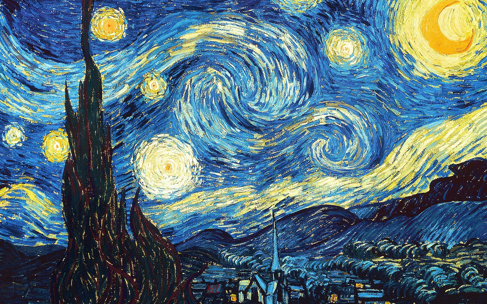

# wallpaper
00

01

02

03

04

05

06

07

08

09

10

11

12

13

14

15

16

17

18

19

20

21

22

23

24

25

26

27

28

29

30

31

32

33

34

35 
36 
37   
38   
39   
40   
41   
42   
43   
44   
45   
46   
47   
48   
49   
50   
51   
52   
53   
54   
55   
56   
